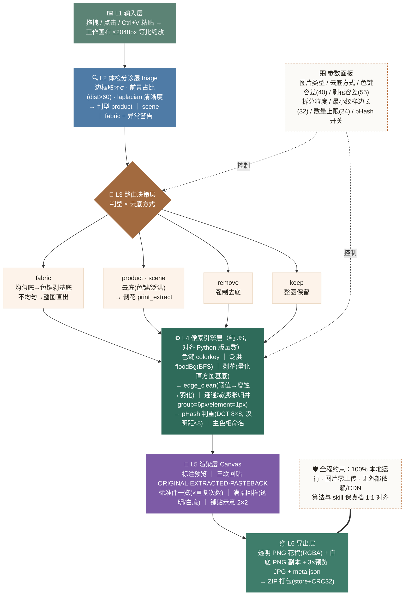
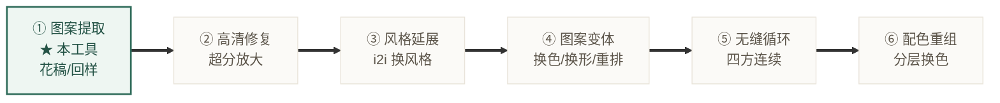

# 🌸 图案提取工作台 · Pattern Extraction H5

把任意**服装图 / 面料图 / 商拍图 / 网感图**里的印花纹样，转换成可直接使用的设计资产：**独立花稿（透明底 PNG）、满幅花型回样、纹样台账**。

算法 1:1 复刻自 [pattern-extraction skill](https://github.com/) 的保真档（像素级），单 HTML 文件、双击即用。

`100% 离线 · 图片不出本机` `单 HTML 文件 · 零安装` `Windows / macOS / Linux 通用` `v1.0 · 2026-09`

**👉 使用方式：下载 [`pattern-extractor.html`](./pattern-extractor.html)，浏览器双击打开即可。**

---

## 目录

1. [这是什么 / 不是什么](#1-这是什么--不是什么)
2. [使用场景](#2-使用场景)
3. [适用人群](#3-适用人群)
4. [快速上手](#4-快速上手三步)
5. [功能结构 · 架构图](#5-功能结构--架构图)
6. [输出产物结构](#6-输出产物结构zip-包)
7. [已知边界](#7-已知边界诚实声明)
8. [FAQ](#8-faq)

---

## 1. 这是什么 / 不是什么

> **✓ 它是**：浏览器里的「保真档」图案提取器。用像素级算法（色键去底、剥花、连通域拆分、pHash 判重）把图片里的印花**原样抠取**成透明底花稿——零幻觉、颜色形状与原图完全一致，并输出与命令行版同约定的产物包（`00_raw / 01_extracted / meta.json`）。

> **✗ 它不是**：AI 生图重绘工具。浏览器无法直连生图 API（CORS 限制），所以这里不提供「AI 重绘更干净」的全自动档——那条路走命令行 skill 主通道；工具内附手动档提示词卡，可粘贴到 ChatGPT / GPT-Image / Nano Banana 等任意生图工具使用。

两条路线互补：**保真档 = 原样抠取零幻觉**（褶皱光影会保留）；**AI 档 = 重绘干净**（还原平面布料色，但可能有色漂）。

## 2. 使用场景

| 场景 | 说明 |
|---|---|
| 🛍 **竞品拆解 / 电商选品** | 拿到竞品白底商品图，几秒剥离胸前印花成独立花稿，供设计做风格借鉴、查重避撞车、上架比价分析 |
| 🧵 **面料采购 / 打样沟通** | 面料平铺图提取标准单元或满幅回样，连同 ×重复次数台账一起发给供应商，花型描述不再靠嘴 |
| 🎨 **独立设计二创 / 换色** | 从旧衣图、二手平台网感图里抠出纹样素材（RGBA 透明件），直接进设计软件做变体、重排、配色 |
| 📚 **服装档案数字化** | 老花型、库存面料照片批量建档：自动判型、主色命名（`red_01…`）、重复次数与位置记录进 meta.json |
| 🤖 **AI 出图的前置素材** | 提取的花稿 / 满幅回样作参考图，配合内置提示词卡到任意生图工具做重绘、风格延展、变体生成 |
| 🔒 **隐私敏感环境** | 未公开款、内部资料、客户样衣——全程本机处理、零上传，断网也能用 |

## 3. 适用人群

- **服装 / 印花设计师** —— 花稿素材收集
- **电商运营与买手** —— 竞品图案分析
- **面料跟单 / 花型编辑** —— 供需沟通
- **服装专业学生教师** —— 教学演示
- **独立设计师 / 小工作室** —— 无预算上专业软件
- **手作 / 改衣爱好者** —— 旧衣纹样复用
- **进阶用户** —— 配合 skill 命令行走 AI 全自动档

不需要任何编程或设计软件基础：会拖文件、会调滑杆，就能用。懂设计的人可深入调容差玩出精度。

## 4. 快速上手（三步）

1. **打开并放入图片** —— 双击 `pattern-extractor.html` → 拖入图片 / 点击选择 / `Ctrl+V` 粘贴截图。顶部立即给出「体检条」：判型建议、清晰度、底色均匀度。
2. **点「开始提取」** —— 默认参数即开即用。想精细控制？图片类型、去底方式、拆分粒度、两组容差、数量上限都可调。
3. **取走结果** —— 「纹样」页逐件下载透明 / 白底 PNG；「满幅回样」页取整片花型；「导出」页一键打 ZIP（含 meta.json 台账）。

### 参数微调速查表

| 症状 | 调整 |
|---|---|
| 花稿边缘带白边 / 底色残留 | 「色键容差」调高（40 → 60） |
| 花瓣被误删（主花色被当成衣底色剥掉） | 「图片类型」改选 `fabric`，或「剥花容差」调低 |
| 碎片太多、噪点小件 | 「最小纹样边长」调大，或粒度保持 `group` |
| 花芯花叶被拆成多件 | 粒度选 `group`（6px 归并半径） |
| 密集小花漏检 / 超上限被截断 | 「数量上限」调大、「最小纹样边长」调小 |
| 只想要整片花布不拆件 | 「满幅回样」页直接取，或去底方式选 `keep` |

## 5. 功能结构 · 架构图

六层管线自上而下：**输入 → 分诊 → 路由 → 像素引擎 → 渲染 → 导出**。



### 在印花模块中的位置（板块关系）



> ⚠ **满幅回样 ≠ 无缝循环单元**——无缝是板块⑤的职责，提取端不越界。本工具产出直接对接后续板块的输入规格（RGBA 花稿 / 1024 回样）。

## 6. 输出产物结构（ZIP 包）

```
工作区名_pattern_extract.zip
└─ 工作区名/
   ├─ 00_raw/
   │  └─ 原图.xxx                 ← 原始输入存档
   ├─ 01_extracted/
   │  ├─ red_01.png               ← 透明底花稿（RGBA，直接可用）
   │  ├─ red_01_white.png         ← 白底副本
   │  ├─ …（每类纹样一对）
   │  ├─ preview_annotated.jpg    ← 标注预览（检测框+编号）
   │  ├─ preview_contact.jpg      ← 标准件一览（×重复次数）
   │  ├─ preview_pasteback.jpg    ← 三联回贴对照
   │  └─ meta.json                ← 台账：判型/路线/参数/纹样清单/警告
   └─ README.txt                  ← 包内说明 + 后续板块衔接提示
```

目录约定与命令行版 skill 完全一致，ZIP 包可直接作为板块 2–6 的输入工作区。

## 7. 已知边界（诚实声明）

- **像素级 = 原样抠取**：衣服褶皱、光影会跟着留在花稿里（AI 重绘版可抹平，本工具不重绘）
- **scene / vibe 图**：浏览器版无 rembg 主体抠图，用边缘泛洪近似，复杂背景效果有上限
- **文字印花**：可原样抠出；但「重绘不走样」的字体修正属 AI 档，本工具不具备
- **复杂密集图形**：定位框偏粗、小件可能漏检——调参数可缓解，标注微调暂未实现（与 skill 路线一致）
- **product 路线语义**：占比最大的颜色被视为「衣底色」剥除——满印面料图请手动改选 fabric 判型（页面会自动提示）

## 8. FAQ

<details>
<summary><b>需要联网吗？</b></summary>
不需要。整个工具是一个 HTML 文件，双击离线可用，无 CDN、无外部字体。
</details>

<details>
<summary><b>图片会被上传吗？</b></summary>
永远不会。所有计算在你浏览器的内存里完成，关页面即消失。
</details>

<details>
<summary><b>支持批量吗？</b></summary>
界面内一次一张（换图即可继续）；真正的批量跑池用命令行 skill 的 <code>--batch</code>。
</details>

<details>
<summary><b>为什么结果和 AI 重绘版不一样？</b></summary>
本工具是保真档：像素级原样抠取、零幻觉，但褶皱光影会保留；AI 档重绘更干净、还原平面布料色，但可能有色漂。两条路线互补，按需选用。
</details>

<details>
<summary><b>用什么浏览器？</b></summary>
新版 Edge / Chrome / Firefox / Safari 均可（需支持 Canvas 与 ImageData，近五年版本都行）。
</details>

<details>
<summary><b>提取结果能商用吗？</b></summary>
工具本身不限制；但提取出的图案版权归原设计方，二创/商用请自行确认授权。
</details>

---

<footer>pattern-extraction skill · 板块1 图案提取 H5 复刻版 · 满幅回样 ≠ 无缝循环单元（无缝属板块⑤职责） · 2026-09</footer>
