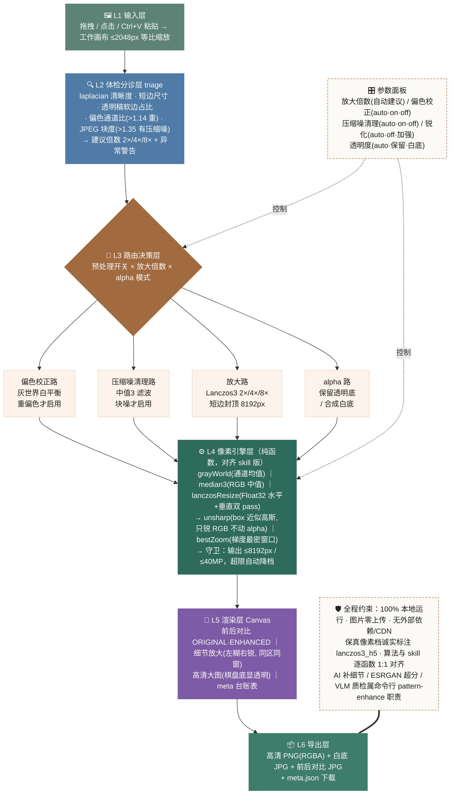
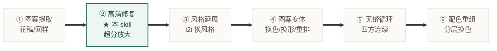

# 🔍 纹样高清化 · Pattern Enhance Skill

把**低清花稿**一键高清化：糊图 → 补细节 → 补纹理 → 4096² 可用大图。印花模块板块2。

`命令行 skill · 任意 Agent 可跑` `三路线：全自动 / 手动档 / 离线兜底` `宪法：只修质量，永不改设计` `v1.0 · 2026-09`

**👉 使用方式**：把本文件夹放进 `~/.claude/skills/`，让任意 Agent（Claude Code / Codex 等）执行下方命令。上游是板块1 图案提取（[pattern-extraction](../pattern-extraction/README.md)）——它产出的花稿可直接喂进来。

---

## 目录

1. [这是什么 / 不是什么](#1-这是什么--不是什么)
2. [使用场景](#2-使用场景)
3. [快速上手](#3-快速上手)
4. [三引擎架构](#4-三引擎架构)
5. [输出产物结构](#5-输出产物结构)
6. [已知边界](#6-已知边界诚实声明)
7. [FAQ](#7-faq)

---

## 1. 这是什么 / 不是什么

> **✓ 它是**：一条带质检回路的修复流水线。生图模型负责「从糊里还原细节」，ESRGAN 负责「把细节放大到生产尺寸」，VLM 负责盯梢——入口先验明正身（是不是花稿），出口逐张比对设计一致性。过不了校验就回炉换变量重试，还不行就降级为保真像素档并**如实告知**，绝不冒充。

> **✗ 它不是**：重绘器 / 风格化工具。宪法一条——**只修质量，永不改设计**：不改造型、不改颜色、不改构图。想换风格、换配色、做无缝循环，是板块 3/5/6 的职责，本 skill 会明确指路而不是越界硬做。服装照片也进不来——资格门会把「整件衣服」指回板块1 先提取。

## 2. 使用场景

| 场景 | 说明 |
|---|---|
| 🧵 **打样 / 生产前处理** | 供应商给的图只有 300px，放大到 4096² 再进印花开发流程 |
| 🛍 **竞品细节分析** | 模糊的竞品图高清化后看清纹样细节、针法、色号 |
| 📚 **档案数字化** | 老花型扫描件、缩略图批量拉到可用分辨率 |
| 🤖 **AI 出图补质量** | AI 生成的花稿（1024 固定输出）超分到印刷尺寸 |
| 🖥 **展会演示** | 前后对比图（before_after.jpg）自动生成，放大区自动选梯度最密处 |

## 3. 快速上手

```bash
# ① 冷启动：探测像素引擎（ncnn_vulkan / lanczos_only）
python scripts/check_env.py

# ② 高清化：一张图或整个目录
python scripts/enhance.py 低清花稿.png
python scripts/enhance.py ../pattern-extraction工作区/01_extracted/   # 批量，自动续接工作区
```

| 依赖 | 有 → | 没有 → |
|---|---|---|
| `DASHSCOPE_API_KEY`（环境变量） | 全自动主链（生图+VLM 质检） | 手动提示词卡 / 离线像素档 |
| `tools/realesrgan/`（已内置）+ Vulkan GPU | 4× 超分（核显实测可用，无需独显） | PIL Lanczos，结果诚实标注 `lanczos_only` |
| `pip install pillow numpy scikit-image` | 全部校验 | 部分校验降级 |

### 判型翻车逃生口

| 症状 | 调整 |
|---|---|
| 平色稿被判成水彩、后处理走错路 | `--texture flat` |
| 满幅布料被判成单花 | `--carrier allover` |
| 稿件够大仍想重绘补细节 | `--force` |
| 只要放大不要生图（保真优先） | `--gen off` |

## 4. 三引擎架构

六层管线自上而下：**输入 → 体检 → 路由 → 像素引擎 → 渲染 → 导出**。



### 在印花模块中的位置（板块关系）



**为什么可信**：生图重绘天然会漂（实测：平色稿被水彩化、叶子重排），所以每张结果强制过六道校验；透明稿走 **alpha 分源 + bbox 配准**——RGB 用重绘高清版、轮廓 alpha 用原图放大版，从机制上保证重绘改不了外形。宪法不是靠提示词求模型，是靠校验层执行。

## 5. 输出产物结构

```
工作区/
├─ 00_raw/原图.png                ← 输入存档（独立输入时）
├─ 01_extracted/…                 ← 板块1 产物（续接时已存在）
├─ 02_hd/
│  ├─ 原名_hd.png                 ← 高清稿（透明/白底随源，最高 8192）
│  ├─ before_after.jpg            ← 前后并排 + 细节最密区放大对比
│  ├─ meta.json                   ← 资格门/判型/三段/六道校验/每次回炉全记录
│  ├─ _prompt_card.txt            ← 手动档提示词卡（短边<1024 时自动写）
│  └─ _gen_1.png                  ← 生图原稿留档（复盘/被撤下原因）
└─ meta.json                      ← 工作区台账 record_step("hd") 记 lineage
```

stdout 一行 JSON：`{ok, files, warnings, next_action, gate, triage, stages, method, seconds}`，
`method ∈ ncnn_vulkan | lanczos_only | skipped_already_hd`——失败也有结构化出口，Agent 拿到就能继续对话。

## 6. 已知边界（诚实声明）

- **生图档可能被撤下**：版画/复杂纹样类，VLM 从严比对常判生图漂移 → 回炉后仍交付像素档（结构 100% 保真但无补纹）。展会演示建议选镶嵌画/花卉类样例
- **质地判型偶偏**：自带羽化软边的平色稿可能被判 watercolor——链路无毁稿风险，`--texture` 一键覆盖
- **满幅稿四边连续性**超阈只报不修——无缝循环是板块5 的职责，不越界
- **全自动档图片会上传云端**（DashScope API）；离线档全程本机。未公开款请斟酌路线
- **耗时 40-92s/张**（回炉触发时偏上限）；≥2048 的图默认跳过（已是高清）

## 7. FAQ

<details>
<summary><b>必须装 GPU 吗？</b></summary>
不用。有 Vulkan 的核显就够（AMD 780M / Intel 核显实测可用）；连它都没有自动落 Lanczos 并在结果里诚实标注 <code>lanczos_only</code>，永不硬失败。
</details>

<details>
<summary><b>会不会把我的设计改掉？</b></summary>
生图重绘天然会漂，所以出口有 VLM 设计一致性比对 + 主色板距离 + alpha 面积守卫六道校验：不过就回炉换变量重试（≤2 次），还不行就撤下生图档、交付保真像素档并明确告知。meta.json 记录每一次尝试，被撤下的生图原稿留在 <code>_gen_N.png</code> 可复盘。
</details>

<details>
<summary><b>为什么我上传的服装照片被拒收了？</b></summary>
设计如此。资格门只放行花稿/纹样——把整件衣服放大没有业务意义。它会告诉你先走板块1（pattern-extraction）提取，<code>next_action</code> 字段带指路信息。
</details>

<details>
<summary><b>没有 API key 能用吗？</b></summary>
能。① 离线像素档：ESRGAN/Lanczos 超分+锐化，结构 100% 保真（无补细节）；② 手动档：脚本写出提示词卡，贴到任意生图工具生成后把结果图丢回工作区，<code>--gen off</code> 接力做校验+超分+打包。
</details>

<details>
<summary><b>1024 的 AI 生成图有必要过一遍吗？</b></summary>
有。短边 ≥1024 不进生图段（不重绘），直接走 ESRGAN 4× 接力到 4096²——这正是「AI 出图补质量」场景，零设计漂移风险。
</details>

---

<footer>pattern-enhance skill · 印花模块 板块2 纹样高清化 · 只修质量，永不改设计 · 上游 pattern-extraction（板块1） · 2026-09</footer>
