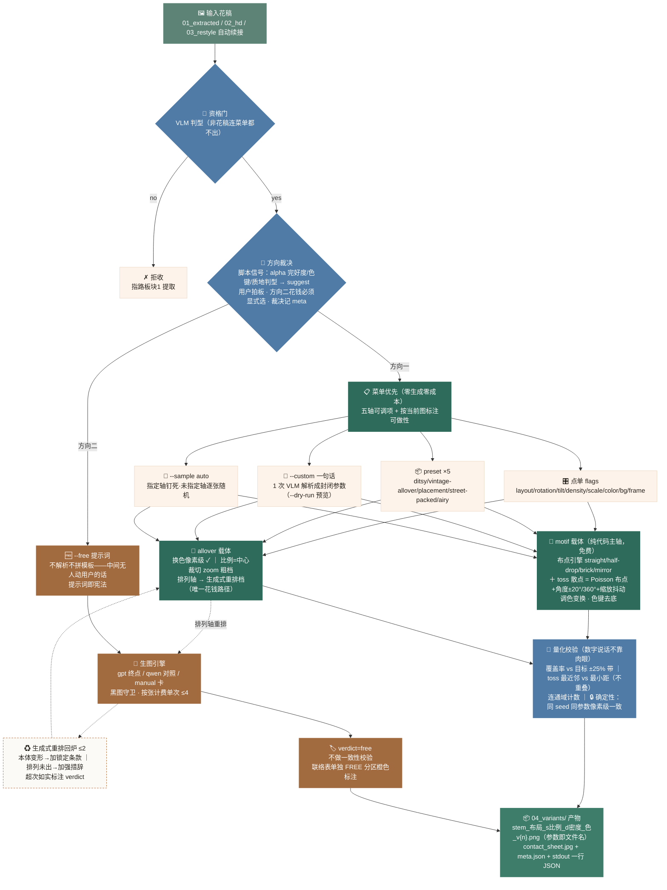

# 🧩 图案变体 · Pattern Variants Skill

把**同一张花稿**出一批不同观感的系列花稿：改排列、改密度、改比例、改配色。印花模块板块4。

`命令行 skill · 任意 Agent 可跑` `菜单优先：用户没下单永不生成` `两方向：参数化道 + 自由道` `宪法：只改排布配色，不改本体` `v2.3 · 2026-09`

**👉 使用方式**：把本文件夹放进 `~/.claude/skills/`，让任意 Agent（Claude Code / Codex 等）执行下方命令。上游是板块1 图案提取（[pattern-extraction](../pattern-extraction/README.md)）、板块2 高清修复（[pattern-enhance](../pattern-enhance/README.md)）、板块3 风格延展（[pattern-restyle](../pattern-restyle/README.md)）——产物直接喂进来，工作区自动续接。架构全景见 [`../pattern-variants-arch.png`](../pattern-variants-arch.png)。

---

## 目录

1. [这是什么 / 不是什么](#1-这是什么--不是什么)
2. [使用场景](#2-使用场景)
3. [快速上手](#3-快速上手)
4. [架构：两方向分岔拓扑](#4-架构两方向分岔拓扑)
5. [输出产物结构](#5-输出产物结构)
6. [已知边界](#6-已知边界诚实声明)
7. [FAQ](#7-faq)

---

## 1. 这是什么 / 不是什么

> **✓ 它是**：一稿出系列花稿的**两方向**流水线。**方向一（参数化道）**：五轴菜单（排列/方向性/密度/比例/配色，每轴有固定选项也接受一句话描述）→ 用户点单 → 纯代码主轴生成（免费）→ 量化校验（覆盖率/最近邻/连通域，数字说话不靠肉眼）。丰富度主增量是 **toss 散点布局**：Poisson disk 布点 + 角度缩放抖动，出真正的面料感而不是机器网格；同 seed 同参数**像素级可复现**。**方向二（自由道）**：照片级/扎染/满幅肌理这类复杂图案，参数轴怎么改都不好——`--free "提示词"` 把用户的话原封不动连图一起交给生图模型，不解析不拼模板不质检，产物亮明 `verdict=free` 单独标注。**菜单优先**：不带参数只出菜单（零生成零成本），用户拍板才动手。

> **✗ 它不是**：图案本体改造器。宪法一条——**只改排布与配色，不改图案本体**：花不能多、不能少、不能重画（纯代码档数学保证，想改都不行）。加删元素/换画法是板块 3 的职责；指定色板重上色是板块 6 的职责；四方连续无缝循环是板块 5 的职责，越界需求一律指路。方向二不是「智能变体」——它不做任何校验，产物性质由用户提示词决定，所以单独标注不与变体产物混装。

## 2. 使用场景

| 场景 | 说明 |
|---|---|
| 🌼 **系列花稿开发** | 一稿出 ditsy 清新碎花 / vintage 复古满铺 / street-packed 高街满铺系列，客户挑款 |
| 🧵 **排列改型** | 死板网格 → toss 散点/半降/砖形，出面料感（v1 参数工具做不出的那种） |
| 📏 **密度与比例适配** | 同一花稿出稀疏留白版（雪纺）/ 满铺版（卫衣）；大花/小花/独幅定位 |
| 🎨 **配色快档** | hue 旋转/做旧/提亮/单色化/双色调，秒级出对比（指定色板重上色见板块6） |
| 🧗 **复杂稿轴外需求** | 「保留笔触转黄昏暖调」这类参数轴装不下的 → `--free` 直通 |
| ♻️ **可复现交付** | 参数写进文件名和 meta，客户三个月后说「就要上次那张第 3 版」——同 seed 复跑像素一致 |

## 3. 快速上手

```bash
# ① 冷启动：探测路线（方向一纯代码永远在线；route 只管方向二/满幅排列档）
python scripts/check_env.py

# ② 默认=菜单模式：资格门+方向建议+全菜单（零生成零成本，给用户挑）
python scripts/variants.py 花稿.png

# ③ 下单方式（四选一或组合）
python scripts/variants.py 花稿.png --layout toss --rotation two-way --density sparse   # 点单式
python scripts/variants.py 花稿.png --preset ditsy                                      # 行业方案一键（5 选）
python scripts/variants.py 花稿.png --custom "疏一点的四向散点，整体偏蓝" --dry-run      # 一句话→参数，先看后跑
python scripts/variants.py 花稿.png --sample auto --seed 7 --count 8                    # 系列采样

# ④ 方向二：自由生成（按张计费，用户显式选择才走）
python scripts/variants.py 花稿.png --free "保留笔触，整张转黄昏暖调，氛围再浓郁一点"
python scripts/variants.py 花稿.png --free "..." --engine manual    # 手动档提示词卡
python scripts/variants.py 花稿.png --collect                        # 手动档结果回接
```

| 依赖 | 有 → | 没有 → |
|---|---|---|
| `pillow numpy scipy scikit-image` | **方向一全轴可做（免费，离线）** | pip install -r requirements.txt |
| `DASHSCOPE_API_KEY` | VLM 资格门 + `--custom` 一句话解析 | 判型降离线档、`--custom` 不可用 |
| `OPENAI_API_KEY`（+`OPENAI_BASE_URL`） | 方向二 GPT 终点引擎 | qwen 对照档（`DASHSCOPE_API_KEY`）或手动档 |

### 五轴一览

| 轴 | 选项 | 一句话 |
|---|---|---|
| 排列 `--layout` | straight / half-drop / brick / mirror / **toss 散点**（Poisson+抖动，配 `--rotation`） | "斜着排""乱一点但别太挤" |
| 方向性 `--rotation` | one-way / two-way ±20° / four-way 360°（toss 专属） | — |
| 密度 `--density` | sparse 25% / medium 50% / dense 75% / packed 90% | "比原图疏一半" |
| 比例 `--scale` | ditsy / medium / large / placement 独幅定位 | "花朵再大两成，别顶到边" |
| 配色 `--color` | hue<N> 任意度数 / invert / mono / duotone / vintage / bright / gray | "整体往冷调偏一点" |

外加 `--tilt` 斜排、`--bg` 底色（white/transparent/#hex）、`--frame` 画幅（square/2:3/3:2/width145）。

### 判型翻车逃生口

| 症状 | 调整 |
|---|---|
| 满幅布料被判成单花 | `--carrier allover` |
| 满幅稿排列轴想强制纯代码 | `--engine pixel`（排列轴做不了会如实报） |
| 系列每张都一样 | 网格布局无随机性——用 `--sample auto` 或 `--layout toss` |
| 一句话解析不对 | 换说法重试，或拆成逐轴选项 |

## 4. 架构：两方向分岔拓扑

资格门过了之后每个「图 × 需求」组合分岔：方向一参数化（免费为主），方向二自由（花钱、用户显式选）。脚本出建议，用户拍板。



### 在印花模块中的位置（板块关系）


**为什么可信**：方向一的宪法不靠自觉——纯代码档想改本体都改不了（布点/调色都是数学变换），出口再用覆盖率/最近邻/连通域的**数字**对照目标，越界如实报警；确定性由测试钉死（同 seed 同参数像素一致）。方向二诚实标注 free——不装作校验过。

## 5. 输出产物结构

```
工作区/
├─ 00_raw/ … 03_restyle/        ← 上游产物（续接时已存在）
├─ 04_variants/
│  ├─ 原名_tossT_s22_d25_v1.png  ← 参数即文件名（布局_比例_密度_色），可复现锚
│  ├─ contact_sheet.jpg          ← 联络表（ORIGINAL + 变体区 + 方向二 FREE 分区）
│  ├─ meta.json                  ← seed/全参数/提示词原文/verdict/量化度量全记录
│  └─ _free_prompt_card.txt      ← 方向二手动档提示词卡
└─ meta.json                     ← 工作区台账 record_step("variants")
```

stdout 一行 JSON：`{ok, files, warnings, next_action, direction, carrier, suggest, seed, items[{mode,file,measures,plan|prompt,verdict}], seconds}`——`direction=1|2`、菜单模式带完整 `menu` 字段，失败也有结构化出口。

## 6. 已知边界（诚实声明）

- **网格布局无随机性**：straight/half-drop/brick/mirror 是纯参数变换，同参数复跑结果相同（seed 不影响）——要系列差异用 toss 或 `--sample auto`，脚本会主动警告
- **满幅稿三档受限**：换色像素级 ✓；比例是中心裁切粗档（zoom 估算）；密度轴不可控——排列轴走生成式重排档（花钱、回炉≤2、超次如实标注）
- **toss 不重叠优先**：覆盖率目标设太高时保不重叠、覆盖率如实偏离并警告（可降密度或加大比例）
- **方向二不质检**：产物性质由用户提示词决定，只有黑图守卫；`verdict=free` 如实标注，不与变体产物混装
- **GPT 终点档待 key**：qwen 对照档与手动档已验通；GPT 档（透明底原生/多参考图）等 `OPENAI_API_KEY` 补跑
- **不支持目录批量**：方向二按张计费易烧钱；方向一系列用 `--sample auto --count N`

## 7. FAQ

<details>
<summary><b>为什么默认不生成，只出菜单？</b></summary>
菜单优先是三轮拍板的结果：变体调整空间极大，脚本擅自生成的大概率不是用户要的。默认只出菜单（资格门+方向建议+五轴可调项，零成本），用户点单/preset/一句话/采样四种方式下单后才动手。<b>方向二花真金白银，必须用户显式选择</b>，agent 可以推荐但不许替用户决定。
</details>

<details>
<summary><b>怎么保证系列每张不一样？</b></summary>
两种路：<code>--sample auto --seed N --count 8</code>（未指定轴逐张随机、指定轴钉死）；或 <code>--layout toss</code>（散点本身自带角度/缩放抖动，同布局每张 seed 不同就不同排法）。网格布局是纯参数变换，同参数只有一张。
</details>

<details>
<summary><b>三个月后还能精确复现某一张吗？</b></summary>
能。参数写进文件名（<code>原名_tossT_s22_d25_v1.png</code>）和 meta.json（含 seed），同 seed 同参数复跑像素级一致——这是离线测试钉死的断言，不是承诺。
</details>

<details>
<summary><b>照片级的复杂图案能处理吗？</b></summary>
参数轴不合适（像素变换在复杂边缘上会碎），脚本会建议走方向二：<code>--free "你的提示词"</code> 把原图和你的话直接交给生图模型。产物不质检、单独标注——这是设计而非缺陷：参数轴装不下的需求，硬套参数只会两头不讨好。
</details>

<details>
<summary><b>和板块6 配色重组什么区别？</b></summary>
本板块的 <code>--color</code> 是<b>变换类</b>（hue 旋转/反相/单色化/调性——整稿数学变换）；板块6 是<b>指定色板重上色</b>（给一套目标色，逐元素映射过去）。说「偏蓝一点/做旧」来这，说「换成这五个色」去板块6。
</details>

---

<footer>pattern-variants skill · 印花模块 板块4 图案变体 · 只改排布配色，不改本体 · 菜单优先，用户没下单永不生成 · 2026-09</footer>
